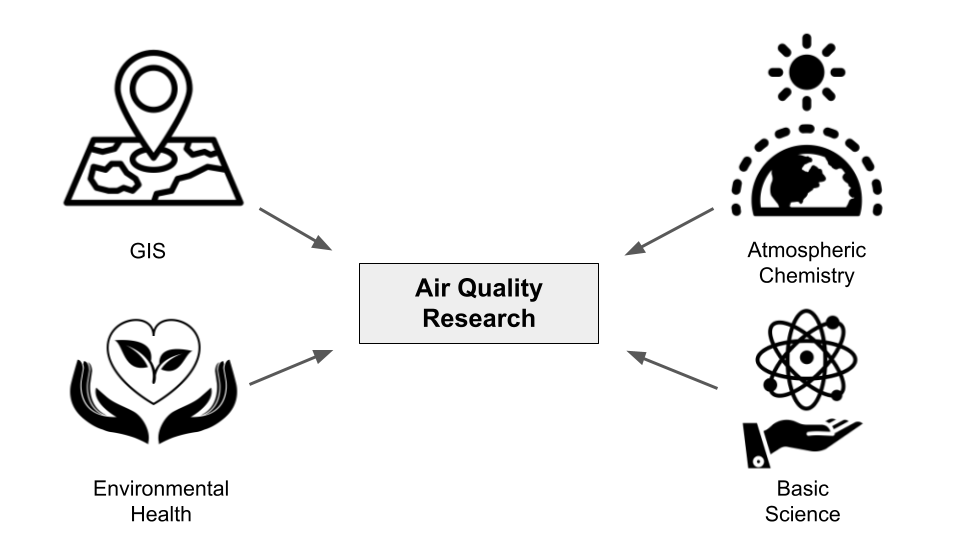

```{r setup, include=FALSE}
options(htmltools.dir.version = FALSE)
xaringanExtra::use_tile_view()

```

# Hello!

My name is Adithi, and I am a Geospatial Data Analyst at ILK Labs in Bengaluru, India and this is my first EARL conference. I use R to work with air quality data. Today, I will present about how I used shiny to build tools to provide a workflow to analyse air quality data.

---

# Who we are?



---

